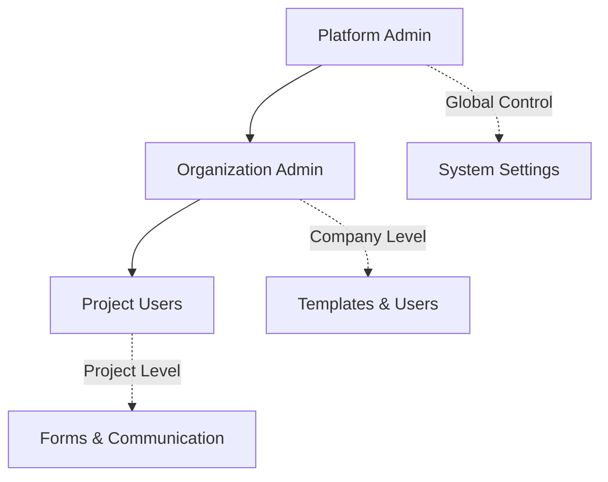

<div align="center">

# 🏗️ **InfrLoop** 

### *The Future of Construction Management*

**Revolutionary • Intelligent • Seamless**

[](https://expo.dev)
[](https://reactnative.dev)
[](https://supabase.com)
[](https://typescriptlang.org)

---

*Transforming construction workflows with cutting-edge technology*

</div>

## ✨ **What Makes InfrLoop Revolutionary?**

🎯 **Multi-Tenant SaaS Architecture** - Scale from startups to enterprise  
🔐 **Three-Tier Security Model** - Platform → Organization → Project levels  
☁️ **Universal Storage Integration** - Google Drive, S3, Box, SharePoint & more  
⚡ **Real-Time Collaboration** - Instant updates across all stakeholders  
📱 **Cross-Platform Native** - iOS, Android, and Web from single codebase  
🎨 **Construction-First Design** - Built by industry experts, for industry professionals  

## 🚀 **Quick Start**

```bash
# Install dependencies
yarn install

# Launch development server
yarn start

# Build for production
yarn build
```

> **Pro Tip**: Use Expo Go for instant preview on your device 📱

## 🏗️ **Core Features**

| Feature | Description |
|---------|-------------|
| 📋 **Project Dashboard** | Real-time project analytics and KPIs |
| 📄 **Dynamic Forms** | JSON-driven, customizable form builder |
| 📐 **Drawing Management** | CAD integration with markup tools |
| 🔄 **Submittal Workflows** | Automated approval processes |
| 💬 **Team Communication** | Integrated messaging and notifications |
| 📊 **Progress Tracking** | Visual timeline and milestone management |

## 🎨 **Technology Stack**

**Frontend**: React Native • Expo Router • Tamagui UI  
**Backend**: Supabase • PostgreSQL • Row Level Security  
**Storage**: Multi-provider (Google Drive, S3, Box, SharePoint)  
**Real-time**: WebSockets • Push Notifications  
**Development**: TypeScript • Yarn • ESLint • Biome  

## 📱 **Platform Support**

- ✅ **iOS** (iPhone & iPad)
- ✅ **Android** (Phone & Tablet) 
- ✅ **Web** (Desktop & Mobile)
- 🔄 **PWA** (Coming Soon)

## 🏢 **User Roles**



## 🔥 **Why Choose InfrLoop?**

> *"Finally, a construction management platform that actually understands our industry"*  
> — Leading General Contractor

- **🎯 Industry-Specific**: Built for construction, not adapted from generic tools
- **⚡ Lightning Fast**: Native performance with cloud scalability
- **🔒 Enterprise Security**: SOC2 compliant with role-based access
- **🔧 Highly Customizable**: Adapt to your unique workflows
- **📈 Scalable**: From single projects to enterprise portfolios

---

<div align="center">

**Ready to revolutionize your construction projects?**

[🚀 **Get Started**](docs/architecture/development-setup.md) • [📖 **Documentation**](docs/README.md) • [🏗️ **Features**](docs/features/feature-specifications.md)

*Built with ❤️ for the construction industry*

</div>
